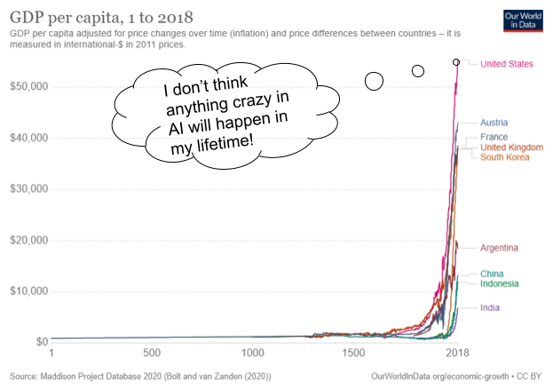
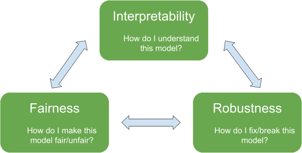
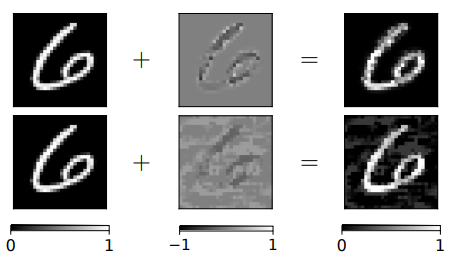
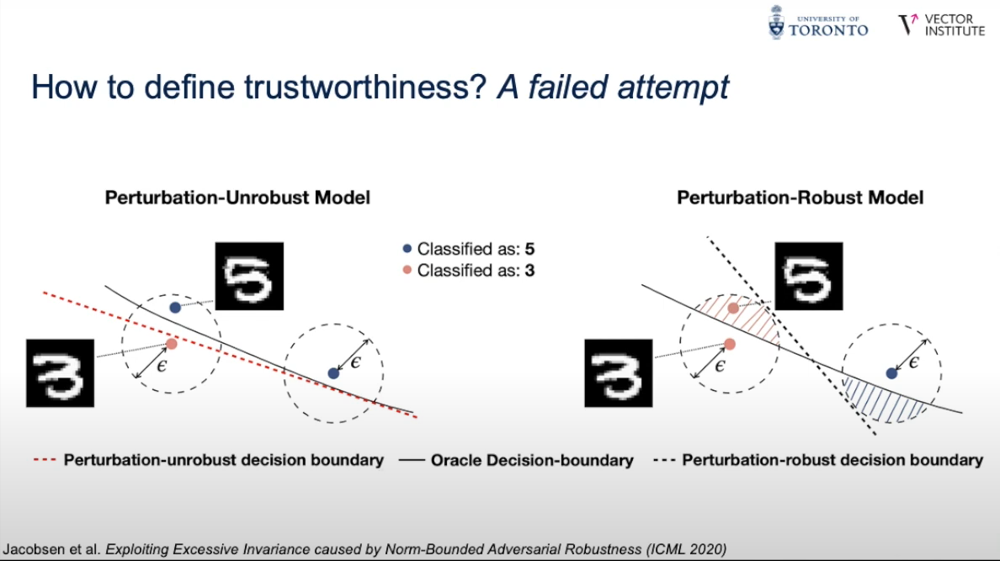



Progress in AI will explode in the coming decades as more effort and resources are poured for its advance in the same capitalist system that allowed GDP per capita to rise at a rate never before seen in human history within the past century. With an increase in AI capabilities comes an increase with its dangers. Artificial General Intelligence (AGI) Safety considers the impacts of AI in the long-term (decades to centuries) of AI models capable of generalizing to domains not specified in training. However, AGI Safety (safety) is still a niche topic within current machine learning research. If it does get treated seriously as a research area, it is often limited to extremely well-funded organizations based in Western countries (e.g. OpenAI, DeepMind in the US, UK, respectively). How can I, an undergrad based in Asia without any connections to any of these organizations, possibly do technical work in AI Safety? In this post, I will provide my current strategy of doing safety work given these constraints. Note that this is a strategy informed by my current knowledge of AI. Discoveries in ML, especially if it leads to certain research areas stagnating, can render parts of this post obsolete, and so my priorities in safety may change over time. Take this with a grain of salt.



Chris Olah from OpenAI argues that a paradigm shift focusing on model interpretability in current machine learning research can lead to accelerated progress in AGI Safety. Many areas of research are focused on improving performance metrics (e.g. accuracy, ROC) and deploying narrow-AI, which are limited to human-specified tasks, on different domains (e.g. healthcare, construction, automating corporate work). However, we are often unaware of the flaws and failure modes of these models, often finding it at deployment, which can cause grave social, economic, and political costs, even death (e.g. Herzberg’s death was caused by a semi-autonomous Uber vehicle in 2018 https://www.bbc.com/news/technology-54175359). 

For the most advanced ML models, of which AGI may likely arise from, unknown failure modes are not the only problem. We scale them up to billions of parameters without really understanding how that leads to more intelligent capabilities, and it leaves us wondering if we can build advanced models more efficiently. In the process, we are likely to be wasting huge amounts of compute and releasing greenhouse gases in an already decaying world. 

Instead of hacking and error, having interpretable models can allow us to understand the capabilities and failure of models comprehensively. Once we discover fundamental properties of 
ML models, including its limitations and the inherent trade-offs of various constraints placed on it, we can develop a principled method of constructing models, designing learning algorithms, and maintaining deployed models. Instead of isolated ML teams publishing state of the art models with arcane architectures and training setups, interpretability can foster the much-needed interdisciplinary collaboration from scientists of different domains who can translate their expertise directly into the model. Furthermore, it can make ML models inclusive to the communities it serves. Target groups who will feel the model’s effects the most can provide feedback that, with the help of interpretability tools, make the model understand and improve itself on this feedback. Potential harms can also be mitigated when these groups understand the capabilities of the model and how it can affect them.

ML Interpretability provides a strong case on why it can lead to safety, and I am currently favoring this as an important path for AI development in general. Interpretability falls under the research area of Reliable ML, which also includes robustness and fairness. While one can directly work in interpretability, I believe work in the adjacent areas of robustness and fairness contributes to discoveries in interpretability, and vice versa. As an added bonus, work on reliable ML addresses tool-AI safety, which are the limited AI models we currently deploy.

Why would one prefer to work in an adjacent area instead of interpretability directly? I generally find research within an adversarial setting more motivating, which is often found in robustness and fairness research. In my opinion, these settings, by having a specific objective, provide a more imminent, concrete, and therefore motivating threat. You are actively challenged by an intelligent entity (an attacker if you are defending) or a complex phenomena (a ML model or the training setup if you are attacking), and so you are forced to take the perspective of your adversary and think of all the potential ways it can outsmart or break your method. Comparing this to a client who wants a specific and better explanation as a motivation for some papers that come up with new interpretability methods, I am less creative in this situation and therefore less motivated.

Besides the motivation, good robustness and fairness research leads to a deeper understanding of a model. I imagine the adversarial setting to be a competitive game. To win at this game, you must create a strong method, which needs to be future-proof (future methods won’t break it) and theoretically practical (in terms of scalability and known limitations). You don’t want your method or the driving idea behind it entombed merely in a paper (unless you are lazily optimizing for publications). **To develop a strong attack or defence, you need a good understanding of your model.** In the process of developing a strong method, you therefore discover fundamental properties of a model that can generalize to different architectures and hopefully training regimes. Understanding the model complements the development of the method too. It allows you to analyze the strengths and limitations of your method.



One limitation is that the alignment of the model is on very specific goals (threat model) that can be formally defined. For example, numerous gradient-based robustness attacks and defences rely on a stringent p-norm distance specification which in practice is an unrealistic assumption. But I think as with safety, Reliable ML is still a budding field and we can expect to see more sophisticated and realistic threat models soon. The advantage of Reliable ML in this case over safety is that it is directly applicable to AI now and therefore an ecosystem exists for funding and support. 

Can we expect a threat model that tackles hard-to-formalize objectives, like a model being reliable in various environments? I think we can as models become more interpretable and therefore allow us to build more advanced AI. Using the gradient-based robustness example, researchers are moving to different distance specifications such as Wasserstein distance that allows a “global” modification of an image compared to the pixel-based modification by the former, which can make for a more sophisticated fooling of both the AI and humans, and therefore a better adversarial setting.

Another limitation would be that robustness and fairness research can create methods that are impractical for reliability. Some can be too limiting and introduce fundamental tradeoffs with performance, but I believe this is a step towards finding better corrections, or rethinking how we design models so they can be more reliable. Both ways focus on understanding the model. A good example would be provably robust classifiers as a defence against adversarial examples. While they provide robustness guarantees within a specified area in the input space, this area is always limited and degrades performance significantly that renders them impractical for many applications. There is a tradeoff between area guaranteed to be robust and model accuracy. 
It turns out that this method moves the decision boundary of a classifier to make a larger area robust, and it can be exploited to create new attack methods! While this can create an arms-race scenario, we have a new understanding of the limitations of the classifier and shift how we view these attacks and defences, such as by rethinking how we fundamentally train our classifiers to escape this race. Regardless, fixing and breaking in a controlled environment makes us discover limitations and dangers we can avoid.

{%marginnote '3' 'Sure, our paradigm may be wrong, but at least it’s within a lab. Fixing and breaking in a controlled environment makes us discover limitations and dangers we can avoid.'}

{%marginnote '4' 'Disclaimer: I know that arms-races are likely to happen. However, I view them as a mechanism to signal where society should focus itself on / avoid. For example with deep fakes, the threat of an arms race requires us to rethink data ownership, in which a technical solution (e.x. blockchain) is necessary but insufficient'.}

{%marginnote '5' 'So can we change our efforts fast enough? I hope so'}

From a capabilities perspective, an increase in our understanding of interpretable ML can shift focus again to increasing performance more rather than safety itself. For example, if there is a fundamental tradeoff between performance and desired behavior X, maybe people will prefer performance and thus keep the tradeoff there. This seems likely at first given that a market economy emphasizes competitiveness and thus organizations may prioritize performance over safety to some extent if it means keeping them competitive. However, this prioritization should decrease once the large costs of deploying dangerous advanced AI becomes clearer.

Has prioritization of avoiding large costs worked before as costs became clearer? It clearly has not with anthropogenic climate change, wherein we still consume fossil fuels at unsustainable levels amidst the glaring evidence of the irreversible harm we are subjecting ourselves to. However, unlike climate change, where evidence linking it to human activity was a gradual process mired with deception by corporations, finding costs of having unsafe advanced AI is relatively straightforward. The discovery of these costs should arise naturally, or at least be aided by, from using the powerful interpretable tools that allowed us to build these advanced AI in the first place. But further still, I do not think a technical solution is sufficient. Maintaining safety as the priority requires intervention from institutions to collectively prevent a dangerous extinction event, maybe akin to nuclear weapons regulation.

To conclude, in terms of the existing ecosystem to support it and the motivation one can gain within an adversarial setting, robustness and fairness research are areas that overall improve how we understand current ML models and their interpretability. Coupled with Olah’s thesis that interpretability can help with long-term AI Safety via alignment, these areas are relevant throughout AI research and provide a realistic path in my position to pursue compared to directly focusing on the budding and western-centric safety field.

References (For images not explicitly referencing themselves):

1. (Unknown Unknowns chart) https://peerinsight.com/blog/key-to-growth-unknown-unknowns/
2. (Wasserstein adversarial examples) https://arxiv.org/abs/1902.07906
3. (Trustworhy ML image) https://www.youtube.com/watch?v=UpGgIqLhaqo