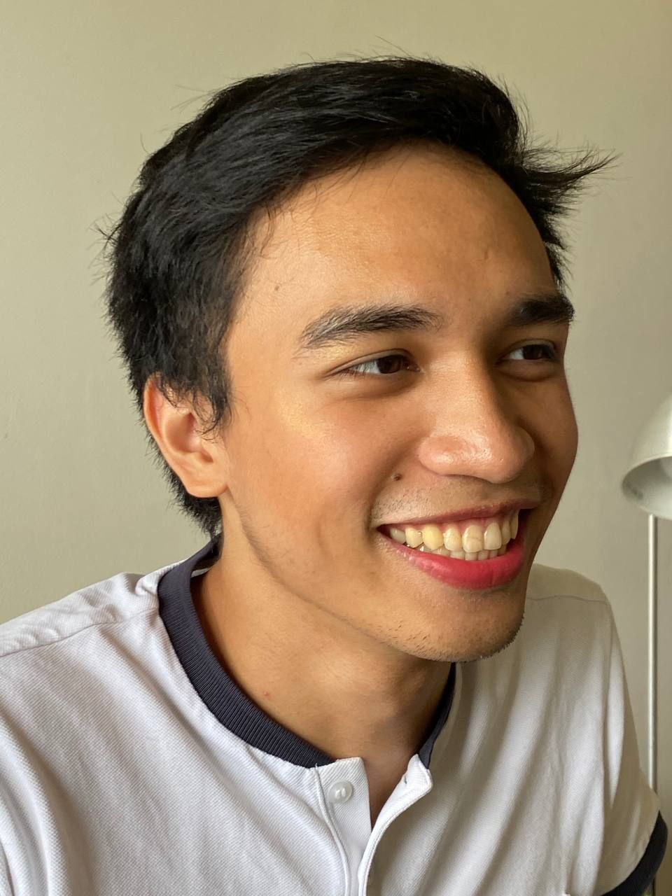

  

Hey! I am broadly interested in making the benefits of Artificial Intelligence (AI), accessible to the most number of people while preventing it from further harming marginalized groups. My overarching project is to use and develop AI technology and governance for positive social and environmental change. Towards this, my mission is to develop Trustworthy AI: AI that is harmless when misused, interpretable and well-understood, fair to its users, and privacy-preserving. Curious? Check out my [Values](/values) and [Research](/research) page. 

Since benefits are not fully enjoyed and applied when it is not understood, I make it a crucial priority to communicate my work to people from different backgrounds through [Medium](https://medium.com/@ajsanjoaquin) or through directly talking to people like in [The Singapore AI Summit 2024](https://asiatechxsg.com/aisummitsingapore/speakers/ayrton-san-joaquin/).

In my free time, I am a researcher at the AI Standards Lab. My research lies on the data used to shape modern AI systems. On the governance side, I am interested in the reporting transparency and evaluation standards of AI systems. On the technical side, I am interested in how data quality affects AI performance, vulnerability, and fragility (especially memorization!). 

I graduated from Yale-NUS College learning on both Statistics and Philosophy, having spent a semester at the University of Copenhagen. My bachelor's thesis was on the intersection of data privacy & data poisoning, and I was advised by Reza Shokri & Michael Choi. A part of that work is [featured](https://www.theregister.com/2022/04/12/machine_learning_poisoning) by *The Register*.

You can find my CV [here](https://ajsanjoaquin.github.io/lol/San%20Joaquin%2C%20Resume.pdf).

As much as I specialize in Machine Learning, I identify as a **generalist**.

I did a lot of (seemingly) random activties throughout college and beyond.
I enjoy the outdoors: doing either cycling, hiking, or navigating above and below the ground. In 09/2021, I have completed cycling around the entirety of Singapore, doing an imperial century in the process (162 km!). In 08/2022, I have gone around the Danish archipelago via bikepacking (≈500 km)! [Here's what we learned](https://drive.google.com/file/d/1_UZhPaeixAkz0IOkJ5fX9BEThES_bPoD/view). In 04/2024, I tried, and failed, to complete cycling around the island of Taiwan (環島 - Huandao) because of the 2024 Hualien Earthquake. In 12/2025, I finally completed it!

I also enjoy performing music on either the keyboard, vocals, or both. You can find concerts involving my bands Arkipelago (2019) [here](https://youtu.be/IDWpC1mmqNs?t=2975) and Sketchy White Van (2022) [here](https://youtu.be/qGI2ng3u13o?t=1437).

I was also a yOuTubEr, when I made scripts for [808CJK](https://www.youtube.com/c/808CJK).

Finally, I have a love of history and asking why the present is the way it is. In the far past, [I represented the Philippines](https://globalnation.inquirer.net/142283/ph-places-5th-in-intl-history-olympiad-medal-count) in the International History Olympiad. 